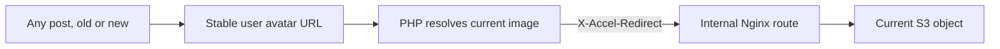
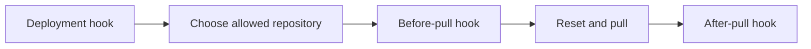

# The Server Will See You Now

An annotated history of RealtAsia's deployment repository.

This is where the application stopped being source code and became somebody's problem at three in the morning.

The repository contains machine-provisioning scripts, Nginx configuration, MongoDB snapshots, SSH material and a small HTTP-triggered deployment system. It captures an early attempt to make RealtAsia reproducibly installable and remotely deployable rather than treating the production server as a sacred animal that could only be approached by its original keeper.

The original commit messages are quoted exactly. Dates below are those preserved in the repository history.

## 23 July 2013: put the server in Git

> **Adding a repository with deployment scripts**  
> 15:39

The first commit collects three kinds of operational knowledge that had previously lived in commands, machines or one engineer's head.

### 1. Machine installation

Two shell scripts install the RealtAsia stack:

- Nginx;
- PHP 5 and PHP-FPM;
- MongoDB;
- PHP extensions for MongoDB, HTTP, images, cURL, encryption and tidying;
- the AWS SDK;
- optionally Gearman and its PHP extension;
- Git and the surrounding Ubuntu package machinery.

The scripts check for root, add the period-specific Nginx and MongoDB repositories, install PECL extensions, edit `php.ini` when necessary and restart PHP-FPM.

This is recognisable infrastructure-as-code from before everyone agreed to call a YAML file a platform.

### 2. Nginx as the traffic boundary

Separate virtual hosts route:

- `api.realtasia.com`;
- `app.realtasia.com`;
- `www.realtasia.com` and the root domain;
- the deployment endpoint.

PHP requests go to a Unix-domain PHP-FPM socket. Application routes fall back to `index.php`. Static assets receive long-lived caching.

The more interesting feature is the internal `/s3/` route. In isolation, it looks like a protected proxy from Nginx to S3. Read alongside RealtAsia's avatar controller, it reveals a much better design.

Every post could refer to a person's avatar through a stable identity-based route: the user ID plus the requested size. The post did not preserve whichever S3 filename happened to be current when it was written.

When that route was requested, PHP:

1. loaded only the user's gender and current avatar pointer from MongoDB;
2. selected the requested size of the current custom avatar;
3. fell back to a size-appropriate gendered default when no custom avatar existed;
4. returned an `X-Accel-Redirect` header pointing at the internal `/s3/` location.

Nginx then took over. It extracted the S3 host and object path, removed the incoming authorisation header, set the correct upstream `Host`, avoided temporary-file buffering and streamed the object with its normal cache metadata.



This solved a subtle social-network problem. A person could change their display picture once and have years of old posts resolve to the new image. The request remained logically dynamic, while PHP never became an image server. Browser and intermediary caching could still operate against the response and its ETag instead of every byte travelling through the application.

It also kept raw S3 locations out of the public interface. The `internal` Nginx location could be reached through the application's authorised redirect, not treated as the product's permanent avatar URL.

The deployment configuration is therefore half of a distributed feature. The controller supplied identity and policy; Nginx supplied delivery; S3 supplied durable objects. None of the three layers was asked to impersonate the other two.

Jason later reconstructed the complete design in [“The Invisible CDN We Built for Display Pics”](https://geekist.co/the-invisible-cdn-we-built-in-2012-for-dynamic-avatars/). That article provides the missing controller code and explains why the stable route mattered across historical posts.

This is infrastructure work hiding in plain sight. The Nginx block is only thirteen lines because the thinking happened before the typing.

### 3. A deployment endpoint

`deploy.php` exposes an allow-listed set of repository names: API, application and common code. Each repository has a small subclass that supplies its path. The shared deployment routine provides `before_pull` and `after_pull` hooks, resets local changes and pulls the configured branch from Bitbucket.

The intention is clear:



This was a compact, extensible deployment mechanism. Different repositories could perform their own post-pull work without duplicating the overall flow.

It also ran `git reset --hard HEAD` on production.

The server was informed that local improvisation would not be entering the historical record.

---

## Eight minutes later: preserve the database too

> **added mongo dump**  
> 15:47

The dump contains collections for:

- agents;
- users and pages;
- posts and comments;
- interactions;
- jobs;
- Ticker feeds;
- OAuth clients and sessions;
- logs;
- postal data;
- MongoDB indexes.

As archaeology, this is unusually valuable. It confirms that the services documented across the other repositories shared a substantial, connected product model. OAuth, social interactions, background jobs and materialised feeds existed as stored collections with indexes and restorable state.

It also shows that deployment meant more than copying code. The operational unit included application state, schema shape and the ability to reconstruct the system around them.

The BSON files are omitted from the public snapshot because they contain application data. That is a publication decision, not the story of this commit.

---

## 24 July 2013, 07:16: absolute certainty becomes relative

> **Changed the repository start path to a relative one**

The base repository path changes from:

```
/home/ubuntu/repos/
```

to:

```
~/repos/
```

This removes one machine-specific username and replaces it with a shell expansion whose meaning depends on which user the web process believes it is.

The code becomes more portable in theory and immediately more philosophical in practice.

---

## 07:28: the deployment repository learns to deploy itself

> **Some more bugs, added deployment repo.**

The deployment repository joins the allow-list alongside API, app and common. The mechanism can now update its own mechanism.

This commit also reformats the script and adds a `Common::after_pull()` hook intended to replace the common module's initialisation file with its live variant after deployment.

The surviving implementation contains a small existential difficulty:

```php
unlink($init);
rename($init, $init_live);
```

It deletes `$init`, then asks `$init` to rename itself.

The desired direction was almost certainly `rename($init_live, $init)`. The written direction gives the deleted file a challenging but character-building afterlife.

This is not evidence that production never deployed. It is evidence that this surviving hook, in this revision, could not perform the replacement it describes. Deployment may have used other scripts or manual correction while this automation was being developed.

---

## 07:32: successful deployment, followed by a 404

> **Bug. forgot to exit script**

After a recognised repository is deployed, the endpoint prints:

> Deployed {repo}

It then continues into the common fallback, returns HTTP 404 and announces that the repository page was not found.

The fix adds `exit`.

Without it, the deployment system's official position was:

> I have successfully deployed your application. Regrettably, I have never heard of it.

This is exactly the sort of bug that only exists because the happy path genuinely ran far enough to contradict itself.

---

## 07:37: paths remain unconvinced

> **relative repos path was not working, still using but tried realpath**

The deployment routine changes:

```php
exec('cd ' . $this->repository, $output);
```

to:

```php
exec('cd ' . realpath($this->repository), $output);
```

The commit message is admirably specific: the relative path was not working, the relative path remained, and `realpath` was invited to mediate.

There is a deeper shell issue. Each PHP `exec()` invocation launches its own command. A `cd` performed in one invocation cannot change the working directory of the later `git reset` and `git pull` invocations.

`realpath` can determine where the party is. It cannot make the next taxi go there.

A robust version would have used PHP's `chdir()`, combined the shell commands, or passed an explicit Git working tree. Again, this describes the checked-in script, not every production action taken around it.

The sequence is nevertheless wonderful:

> Changed the repository start path to a relative one  
> relative repos path was not working, still using but tried realpath

Optimism, observation and bargaining. All within twenty-one minutes.

---

## 11:30: Nginx was missing from the Nginx configuration

> **added nginx.conf which was missing and corrected a bug in virtual host config for api**

The repository gains the top-level `nginx.conf`: worker counts, connection limits, sendfile, TCP behaviour, MIME types, logging, gzip and inclusion of enabled virtual hosts.

The API virtual host also loses the generic long-cache rule for JavaScript, CSS and images. That rule made sense for the browser application, but an API host should not casually treat URL suffixes as immutable presentation assets.

The commit message is funny because `nginx.conf` sounds like the one file an Nginx configuration might reasonably be expected to remember.

The actual correction is sound: global server behaviour and per-host routing are different layers, and both now live together.

---

## 30 July 2013: automate machine identity

> **Added ssh folder**

The repository adds:

- an authorised-keys file;
- an SSH client configuration for Bitbucket;
- a public key;
- the corresponding private key;
- further setup and startup artefacts;
- another database-dump layout.

The goal was unattended deployment. A newly provisioned worker needed a stable machine identity capable of pulling private repositories without a human entering credentials.

The startup process copied that identity into the service user's home directory, assigned conventional SSH permissions and bound Bitbucket to the correct key through an SSH client configuration. Together with the S3-hosted deployment bundle, this allowed a new machine to bootstrap itself into the private RealtAsia estate.

The historical private key is omitted from the public snapshot. Architecturally, the important part is that machine identity, repository access and filesystem permissions were being automated as one provisioning concern.

---

## Twenty-one minutes later: permissions enter negotiations

> **Change perms, named folders, testing update hook**

The Nginx configuration directory is renamed, file modes change and the update hook is tested.

This is deployment work in its natural habitat. The program is conceptually finished. The remaining participants are ownership, directory names and Unix permissions, each of which has independently decided it is the product manager.

The commit also reinforces the purpose of the repository: these were files meant to be consumed by provisioning and update processes, not documentation snippets copied into a wiki and slowly allowed to become fiction.

---

## 31 July 2013: one last pass before separation

> **Adding final changes to this repo before i seperate it out.**

The startup script becomes a more coherent machine bootstrap.

It:

1. creates a dedicated `realtasiaWorker` user and adds it to the web-server group;
2. downloads the deployment bundle from S3;
3. installs the SSH material with explicit `700`, `644` and `600` permissions;
4. configures package sources for Nginx and MongoDB;
5. performs non-interactive system upgrades;
6. installs the complete PHP, Nginx, MongoDB and build toolchain;
7. installs the PECL HTTP extension;
8. pins the MongoDB PHP extension to version `1.3.7`;
9. discovers and installs the AWS SDK channel.

This is an early cloud-init style bootstrap. A largely bare Ubuntu machine could be transformed into a RealtAsia worker from a script and an S3 bundle.

Pinning the Mongo extension is especially telling. Earlier install scripts requested whatever `pecl install mongo` supplied. By the final revision, deployment had learnt that “latest” is not a version; it is an ambush.

The commit says the repository is about to be separated out. It now survives as exactly that separate deployment repository.

The misspelling of “separate” is preserved because spelling was not in the critical path and the server had packages to install.

---

## What this repository proves

The deployment history shows that RealtAsia was operated as a multi-component system, not uploaded as a directory of PHP files.

It had:

- reproducible Ubuntu provisioning;
- distinct web, application, API and deployment hosts;
- Nginx in front of PHP-FPM;
- static caching and gzip;
- stable identity-based avatar URLs with dynamic resolution and Nginx-to-S3 delivery;
- dedicated system identity and permissions;
- private-repository deployment hooks;
- repository-specific lifecycle callbacks;
- database snapshots;
- explicit production dependency installation;
- the beginnings of self-updating infrastructure.

It also shows the difference between architectural intent and a surviving working copy. The overall topology is coherent. Several details in `deploy.php` are plainly defective: shell working-directory scope, the reversed live-init rename and, briefly, the missing `exit`.

That does not make the product unfinished. It makes this repository an honest record of deployment automation being extracted and hardened around a product that already existed.

The strongest evidence is not that every script is perfect. It is that the scripts deal with problems only a deployed system has: web-server routing, long PHP requests, S3 offload, service users, repository credentials, package compatibility, data restoration, permissions and remote update hooks.

Nobody invents a MongoDB dump containing OAuth sessions, Ticker entries and user interactions to make an abandoned mock-up look busy.

They create it because one day they may have to restore the bloody database.

---

## Before making this repository public

One concise housekeeping point: publish the snapshot without the private SSH key, BSON database dumps or embedded credentials. Preserve the complete private history unchanged.

The public version should show the machinery.

It does not need to ship the former occupants of the database with it.
